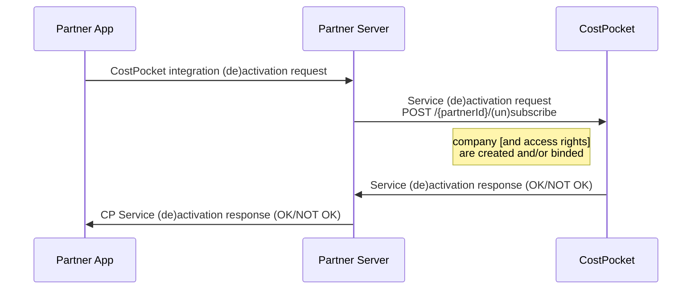
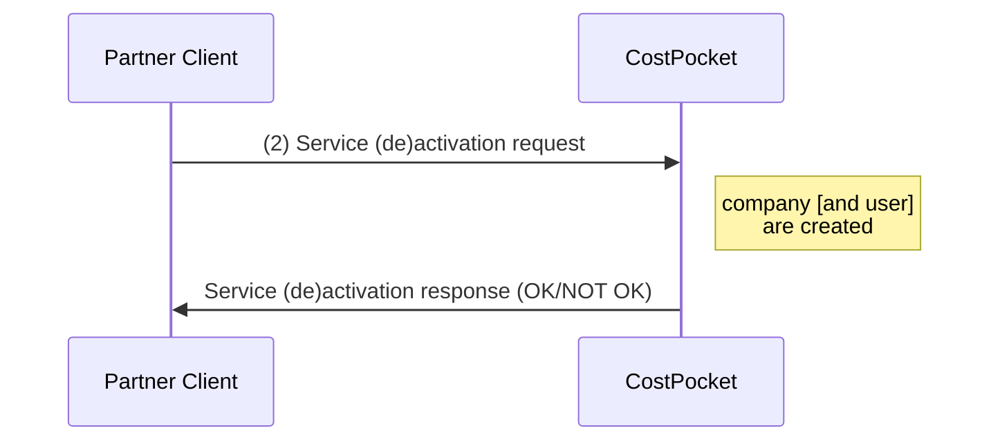
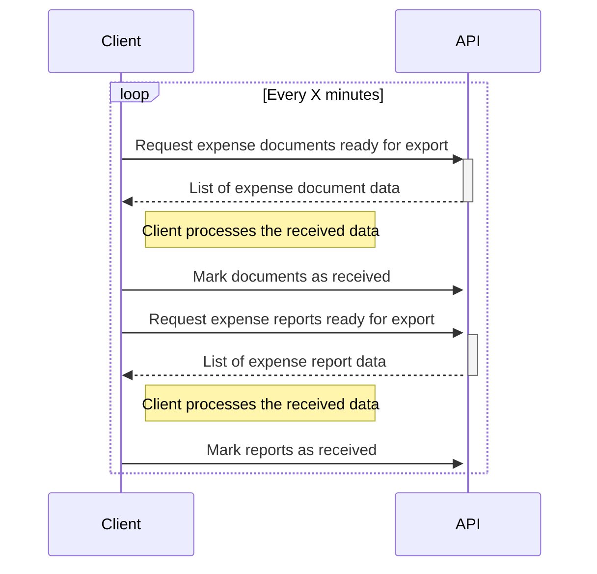

Accounting software integration with CostPocket expense management solutions
---

**Version**: 2023/05/09

<br>
<br>

# Introduction

This is the complete guide for integration solutions with CostPocket. CostPocket is an expense management solution that provides an app for submitting and approving expenses, a cloud solution for managing  organization expenses and various workflow automation tools.

In this guide we will demonstrate how to integrate your accounting solution with CostPocket in order to provide your clients the best tools for expense management. This guide is aimed at both business analysts as well as developers. We will be providing flow diagrams, type definitions and API call examples.

<br>

# What can CostPocket offer?

[CostPocket app](https://app.costpocket.com) is powerful, yet simple - users can submit their expenses individually or via reports. They can create expense, travel and mileage reports. CostPocket app can automatically calculate daily and mileage allowances based on legalizations in many countries.

Our robots help you digitize your expense documents in seconds. Organizations can additionally require a human verification of robot-digitized documents.

CostPocket automates your approval workflows. You can create a workflow based on your organizational needs, weather you are a small company or a large enterprize.

Digitized and approved expenses are automatically sent to your accounting software.

Accountants can additionally use [CostPocket cloud](https://cloud.costpocket.com) for managing expenses and approving them before they are sent to accounting.

<br>

# How can I integrate my accounting software?

1. Decide if you want to add an easy onboarding for your clients. We call this **service activation**. The onboarding flow consists of a simple form your client must fill (company and admin info). The provided data is then sent to CostPocket, where a company is created and integration is set up. After a successful setup, CostPocket sends the client an email notification, which confirms company registration in CostPocket and a short introduction to the service. The onboarding flow works also for clients that have already registered in CostPocket.

2. Identify the suitable integration type for your accounting solution. Are you cloud based or run as an individual application on client's on premises? Do you have an existing API that supports purchace invoice import? Here's a diagram to help you decide:

    ```mermaid
    flowchart TD
        S[What is the type of your application?] -- Cloud app --> A[Do you have an API?]
        A -- Yes --> A1[Online solution]
        A -- No --> A2[Offline solution]
        S -- Onpremise Installation --> B[Where are your backend services hosted?]
        B -- Cloud services --> B1[Online solution]
        B -- Onpremises --> B2[Offline solution]
    ```

    An online solution is where CostPocket sends the expense data to your software. In an offline solution, your software must periodically pull expense data from CostPocket for each of your clients. We will go more into depth in the next chapters.

3. Send us a mail [support@costpocket.ee](support@costpocket.ee) to inform us of your intent. We will configure an integration based on your choices and give you an access to our development environment.

<br>

## Development and release flow

When building and testing the integration, you will be using CostPocket's dev/prelive environment. Applications are hosted in the following addresses:

- Dev/Prelive
    - App: (https://app.pre.costpocket.com)
    - Cloud: (https://cloud.pre.costpocket.com)
    - Parther API: (https://api.pre.costpocket.com/integrations/v1/partner)
    - S2S API: (https://api.pre.costpocket.com/s2s)

- Production
    - App: (https://app.costpocket.com)
    - Cloud: (https://cloud.costpocket.com)
    - Parther API: (https://api.costpocket.com/integrations/v1/partner)
    - S2S API: (https://api.costpocket.com/s2s)

We recomment that you configure your non-production environment only against CostPocket's dev environment. If possible, please provide a free account in your non-production environment to CostPocket, so that our customer support, sales and marketing teams could use it accordingly.

Once the initial integration development is complete, CostPocket will create a production configuration for your accounting solution, share the necessary secrets/keys and release it. Once in production, we try to find first clients to test it and give us feedback. Our sales team always works hands-on with the first customers that try out new integrations.

<br>

## Service activation

For easily onboarding your customers to CostPocket, you can provide them a CostPocket service activation option in your accounting software. Along with the option to activate CostPocket, you must also provide an option to deactivate it. Deactivation will remove the integration from the client company in CostPocket. It does not delete the company!

Service activation endpoints are available in the Partner API.

The service activation requires to know the following information about the client (Service Activation Payload):

1. Organization info (company)
    - **Name** (name) - The name of the organization
    - **Country Code** (countryCode) - The country where the organization is registered. ISO 3166-1 alpha-2 code.
    - **Registration Code** (regCode) - Company registration number.
    - **VAT accountability** (VATAccountable) - Is the company VAT-accountable? Provide the value `null` when VAT accountability is unspecified.
    - **VAT number** (VATNumber) - Company's VAT registration code. Required only when company is VAT accountable.
    -  **Address** (address) - Company registration address - street name and building number (optional).
    - **City** (city) - The city in the full registration address (optional).
    - **ZIP code** - (zip) - The postal code in the full registration address (optional).
    - **BCX code** (bcx) - This is a special parameter that is used to associate a specific organization in your accounting software with specific company in CostPocket. If you are hosting your client's data in cloud then you can use the primary key value of the organization record or any other unique identifier. If your client's data is on-premises, then you need to generate this using random values and save it in client's application. It is recommended to make this value visible to the client. The minimum required length for randomly generated BCX code is 64 bytes. For example using OpenSSL: `openssl rand --hex 32`. If this value has been already generated and saved previously, then it should be reused with every new request.

2. Administrator user info (user). This is the user who will be assigined administrator rights in the registered company.
    - **First name** (firstName) - First name of the user. If they have multiple names, then use all names except the last family name as first name.
    - **Last name** (lastName) - Last name of the user.
    - **Email address** (email) - A valid user's email address. The user will need to use it to sign in to CostPocket. After successful service activation, CostPocket will send a confirmation email to this address. The confirmation email can be customized for your clients.
    - **Language** (lang) - User's language preference as ISO 639-3 language code (optional). If not provided then confirmation email is sent in the official language of the company's registration country or in English.

Here is an example of Service Activation Payload in JSON format (*Please do not use this when testing out the service activation!*):

```json
{
    "company": {
        "name": "CostPocket Demo",
        "regCode": "EE1233445567",
        "VATAccountable": true,
        "VATNumber": "EE1233445567",
        "countryCode": "EE",
        "address": "Tartu mnt 83",
        "city": "Tallinn",
        "zip": "10115",
        "bcx": "af706bdaa3d1b701ef28ea1ea0e3e8e35ae93d19b02906e93a8c3060ff8fa0df"
    },
    "user": {
        "firstName": "Heavy",
        "lastName": "Metalhead",
        "email": "heavy.metalhead@costpocket.ee",
        "lang": "est"
    }
}
```

<br>

When the organization already exists in CostPocket, then our system will force additional security checks on the service activation request. If our system decides that the administrator should log in to CostPocket and confirm the new integration, then the response will contain the following flag:
```json
{
    "userConfirmationRequired": true
}
```

The confirmation notice is sent to company administrators email. They will then be required to login to CostPocket app and confirm the integration. In this case we require that you also display this information to your user as well, notifying them that they need to check their email and follow the instructions to complete this setup.

<br>

For deactivating the service only the following data is required (Service Deactivation Payload):
```json
{
    "company": {
        "bcx": "af706bdaa3d1b701ef28ea1ea0e3e8e35ae93d19b02906e93a8c3060ff8fa0df"
    }
}
```

<br>

### Service activation flow for online integrations
    
Service activation flow differs for online and offline integration solutions. For online solutions, we will provide you with a private key to sign your requests. Request signature is created as follows:
```
signature = HEX_Encode(HMAC("sha256", key, body || timestamp))
```
- **body** must be an unidented JSON string.
- **timestamp** must have at least a second-granularity, for example "2019-01-01T00:00:00Z".
- **body || timestamp** is a string concentanation operation

For example:
```
key=c804c1194d301eef913ff0bdc5be3190
body={"a":1,"b":"c"}
timestamp=2019-01-01T00:00:00Z

signature=77369406addfe02a47f745c125f156d3e639966e5362dd7cc9fc36a1442ac7e5
```

The generated signature must be added to the request header `signature`.

The following diagram shows the service activation/deactivation flow:


Because online integrations use existing acconting solution API, then you must also provide your client's API credentials in the request. This is custom based on your API authentication methods:
```json
{
    "company": {},
    "user": {},
    "integration": {
        "token": "example-token"
    }
}
```

<br>

Example service activation request, using the example key *c804c1194d301eef913ff0bdc5be3190*:
```
POST /{partnerId}/subscribe

HEADERS:
    Content-Type: application/json
    Timestamp: 2022-05-01T10:00:00.000Z
    Signature: 2409400caba4fda3ccce0077ddf88381e8acdee65fb6bfd0cb7889b308c667c0
BODY:
{
    "company": {
        "name": "CostPocket Demo",
        "regCode": "EE1233445567",
        "VATAccountable": true,
        "VATNumber": "EE1233445567",
        "countryCode": "EE",
        "address": "Tartu mnt 83",
        "city": "Tallinn",
        "zip": "10115",
        "bcx": "af706bdaa3d1b701ef28ea1ea0e3e8e35ae93d19b02906e93a8c3060ff8fa0df"
    },
    "user": {
        "firstName": "Heavy",
        "lastName": "Metalhead",
        "email": "heavy.metalhead@costpocket.ee",
        "lang": "est"
    }
}

RESPONSE
200 OK
{
    "userConfirmationRequired": false
}
```

<br>

### Service activation flow for offline integrations

Unlike online integrations, the service activation flow does not require additional request authorization. The following diagram shows the service activation/deactivation flow:



The service activation response will additionally contain credentials for S2S API.


Example service activation request:
```
POST /{partnerId}/subscribe

HEADERS:
    Content-Type: application/json
BODY:
{
    "company": {
        "name": "CostPocket Demo",
        "regCode": "EE1233445567",
        "VATAccountable": true,
        "VATNumber": "EE1233445567",
        "countryCode": "EE",
        "address": "Tartu mnt 83",
        "city": "Tallinn",
        "zip": "10115",
        "bcx": "af706bdaa3d1b701ef28ea1ea0e3e8e35ae93d19b02906e93a8c3060ff8fa0df"
    },
    "user": {
        "firstName": "Heavy",
        "lastName": "Metalhead",
        "email": "heavy.metalhead@costpocket.ee",
        "lang": "est"
    }
}

RESPONSE
200 OK
{
    "userConfirmationRequired": false,
    "apiUser": {
        "apiId": "a2f6aee0-52d7-1ec6-8b8a-79cdb6bca45c",
        "apiToken": "fDURPJ1f1zOEyEb78QWpUl7mjK1fSbNBWj4KJWObPtc="
    }
}
```

NB! If **userConfirmationRequired** flag is true, then the returned API user will not become active before company administrator has confirmed the integration. This means that when using a non-active API user in S2S API requests, the responses will always be empty.

<br>

## Expense data importing for offline integrations

As defined above, offline integration requires your accounting software to regularily pull expense data from CostPocket. CostPocket S2S API hosts endpoints for managing your expense data pulling process. Using the API requires that you obtain client company's API credentials. There are two ways to get these:
- a) Via service activation. At the end of the service activation call, CostPocket returns the API credentials associated with your client.
- b) By manually creating an API user in CostPocket. At the moment, you need to send us a request via [email](support@costpocket.ee) to get the API credentials. In the future we will add the possibility to create them in our cloud solution.

Once you have obtained the API credentials the basic flow of pulling expenses is this:



Detailed API usage description is provided in S2S API.

## Online integration

In an online integration, CostPocket sends expense data to your software in realtime. Online integrations are build against existing accounting software API. We have created integrations over different interfaces: REST, SOAP and even using direct client database connections. In the future, CostPocket will also support WebHooks, so that you could define your own callback endpoints.

<br>

# Additional Features

## Einvoicing

CostPocket enables to send einvoices on behalf of your client and receive einvoices sent to your client as expense documents through existing integration. 

In order to start using einvoicing, the customer needs to a activate it in CostPocket app. There may be additional steps required depending on the client's country of residency. For example Estonian companies need to approve CostPocket as einvoice operator in the e-Business Register.

<br>

### Service

Einvoicing endpoints are available in the Partner API.

Request authentication is almost identical to the authorization in Service Activation. Except that when **bcx** value is required, then it must be present in a request header **bcx**. For offline integrations, it must always be present.

NB! Some features, such as sending einvoices, do not fully work in dev/prelive.

<br>

### Checking einvoicing status

To start sending einvoices on behalf of your client you must check if they have einvoicing activated:

```
GET /{partnerId}/einvoicing/status
HEADERS:
    bcx: af706bdaa3d1b701ef28ea1ea0e3e8e35ae93d19b02906e93a8c3060ff8fa0df
RESPONSE:
{
    "sendingEnabled": true, // backward compatibility
    "receivingEnabled": true,  // backward compatibility
    "roamings": [{
        "regions": ["EE"],
        "sendingEnabled": true,
        "receivingEnabled": true,
        "contractStatus": "OK"
    }]
}
```

The response includes a list of roamings where the clients has an einvoicing contract. Each roaming contains the regions that it supports (ISO3166-1 alpha-2), sending and receiving availability and if the contract for this roaming is valid (OK). The contract is made between the client and CostPocket or a third Party servicing CostPocket for einvoice delivery and acceptance. Contract approval is not always realtime, for example Estonian operators require contract acceptance in Business Registry Portal. When contract is pending approval then the "contractStatus" is `EINVOICING_CONTRACT_PENDING_APPROVAL`.

<br>

### Activating einvoicing

NB! This function is only available for partners using  "Service activation for online integrations" flow v1.

If a client does not have einvoicing active in preferred roaming (region), then it is possible to start the activation for the client. if activation cannot be completed immediatelly, then it is completed asynchronously and the "contractStatus" updates in the background.

For example, a client may be required to go to an external portal to accept the contract or CostPocket may require to verify the client's identity.

```
POST /{partnerId}/einvoicing/activate
HEADERS:
    Content-Type: application/vnd.cp.einvoice.ee+xml
    bcx: af706bdaa3d1b701ef28ea1ea0e3e8e35ae93d19b02906e93a8c3060ff8fa0df
BODY:
    {
        "region": "EE",
        "sendingEnabled": true,
        "receivingEnabled": true
    }
RESPONSE:
    {
        "contractStatus": "OK"
    }
```

Contract status can be any of the following:
- `OK` - Contract was successfully created.
- `EINVOICING_CONTRACT_PENDING_APPROVAL` - Client needs to accept the contract or client verification by CostPocket is pending.
- `EINVOICING_CONTRACT_ALREADY_EXISTS` - Client already has a valid contract. This exception occurs when you try to activate it for a client that already has a contract.

<br>

### Dectivating einvoicing

NB! This function is only available for partners using  "Service activation for online integrations" flow v1.

```
POST /{partnerId}/einvoicing/deactivate
HEADERS:
    Content-Type: application/vnd.cp.einvoice.ee+xml
    bcx: af706bdaa3d1b701ef28ea1ea0e3e8e35ae93d19b02906e93a8c3060ff8fa0df
BODY:
    {
        "region": "EE"
    }
RESPONSE:
    {
        "contractStatus": "TERMINATED"
    }
```

Contract status can be any of the following:
- `TERMINATED` - Contract was successfully terminated.
- `EINVOICING_CONTRACT_NOT_VALID` - Contract is invalid and cannot be cancelled (this is an exception from the actual einvoice operator, who provides the service to CostPocket)
- `EINVOICING_CONTRACT_NOT_PRESENT` - Contract is not present, cannot cancel.

<br>

### Performing receiver lookup

In order to determine if a particular entity can receive einvoices, it is strictly recommended that a lookup query is performed. Lookup query can be done using entity name, registration code or VAT code. The lookup can return multiple results since entities can have similar names. You must provide the entity country code in the lookup query.

```
GET /{partnerId}/einvoicing/receivers?countryCode=EE&regCode=14016832
RESPONSE:
    [{
        "countryCode": "EE",
        "name": null,
        "VATNumber": null,
        "regCode": "14016832",
        "channel": "RIK"
    }]
```

The accepted query parameters for the lookup are:
- `countryCode` - Country code (ISO3166-1 alpha-2).
- `name` - Name of the entity (optional).
- `regCode` - Business registry issued code for the entity (optional).
- `VATNumber` - VAT number of the entity (optional. Note that in some countries, like Estonia, organizations of the same branch can share the VAT number.

The response may contain additional information, such as `channel`, which indicates the service provider used by the entity to receive einvoices. Some information (such as name) is sometimes ommited, if it is not present in einvoice registry.

It is highly recommended to use regCode for entity lookup.

<br>

### Sending einvoices

Einvoices can be sent in various formats. CostPocket automatically converts them to the format required by the roaming vendor. Supported input formats are:
- **application/vnd.cp.einvoice.ee+xml** - Estonian Einvoice standard, version 1.2
- **application/vnd.cp.finvoice.v3+xml** - Finnish Einvoice (Finvoice) standard, version 3+
- **application/vnd.cp.expensedoc.v1+json** - CostPocket ExpenseDoc format, version 1
- **application/vnd.cp.ubl.billing.v3+xml** - Peppol BIS Billing, version 3.0

Select the most convenient format for your application. Perhaps you are even using some of them already?!

Einvoice can be sent with the following request (example):

```
POST /{partnerId}/einvoicing/invoices/{ref?}
HEADERS:
    Content-Type: application/vnd.cp.einvoice.ee+xml
    bcx: af706bdaa3d1b701ef28ea1ea0e3e8e35ae93d19b02906e93a8c3060ff8fa0df
BODY:
    <EInvoice>...</Einvoice>
RESPONSE:
    {
        "success": true,
        "message": "Error message when unsuccessful",
        "id": 124,
        "ref": "e095945435"
    }
```

The parameter **id** in response is an internal ID assigned to the einvoice in CostPocket system. You can ignore that. The **ref** parameter is autogenerated reference value that can be used to track the einvoice delivery status. You can also generate it yourself and provide it with the request (URL parameter **ref**). Make sure that your generated reference value is unique.

<br>

The request can return a Bad Request (400) response in case of exception:
```json
{
    "message": "Exception message in english",
    "codename": "Exception codename"
}
```

The possible exception codes are:
- **CONTENT_TYPE_NOT_SUPPORTED** - The type of content sent in a request body is not supported, meaning the format is not acceptable. This is most likely a programmatic error.
- **MISSING_CONTENT** - Content (body) is missing. This is most likely a programmatic error.
- **INTEGRATION_NOT_ACTIVE** - Your software integration has not been activated for the customer. This happen when they remove it manually in the app or when company admin hasn't confirmed it.
- **MISSING_INVOICE_DATA** - Content is missing required data, such as invoice number, customer or supplier registration code.
- **INVOICE_EXISTS** - Einvoice with the given number (invoice number, not id) already exists. It is unclear at the moment as to how einvoices should be resent.
- **EINVOICING_NOT_ACTIVE_FOR_SENDING** - Client does not have an active einvoicing contract that permits sending. This can happen when they cancel their contract or change their vendor.
- **EINVOICE_COUNTRY_NOT_SUPPORTED** - CostPocket is unable to provide access to einvoice network in the client's country of residence. Currently only Finland and Estonia are supported.
- **EINVOICING_CONTRACT_NOT_PRESENT** - Client does not have an active einvoicing contract. This can happen when they cancel their contract or change their vendor.

We will update the exception codes as the product evolves. Currently exceptions are very detailed, however you do not have to handle each one separately. For the exceptions **EINVOICING_\*** you should direct the client to CostPocket support.

<br>

### Checking einvoice delivery status

Einvoices are not delivered to their destination in real time. The einvoice roaming network consists of multiple vendors who exchange einvoices in short intervals. In order to know if your einvoices were successfully delivered, bounced or are still in delivery, a periodic status check should be performed. The suggested interval is between 5 minutes and 1 hour.

Delivery status check can be performed for all einvoices, as well as for einvoices with specific status and/or tracking reference.

<br>

Here is an example on how to check the status of all einvoices:
```
GET /{partnerId}/einvoicing/invoices/status
HEADERS:
    bcx: af706bdaa3d1b701ef28ea1ea0e3e8e35ae93d19b02906e93a8c3060ff8fa0df
RESPONSE:
    [
        { "ref": "1234", "status": "CREATED", "error": null },
        { "ref": "1235", "status": "SENT", "error": null },
        { "ref": "1237", "status": "DELIVERED", "error": null },
        { "ref": "12310", "status": 'BOUNCED', "error": { "message": "Unknown error!" } }
    ]
```

The possible statuses are:
- **CREATED** - Einvoice has been added to CostPocket. It is waiting to be sent out.
- **SENT** - Einvoice has been sent to the roaming and is in the process of delivery.
- **DELIVERED** - Einvoice recipient has received the einvoice and accepted it.
- **BOUNCED** - Either einvoice sending or delivery failed. In this case the `error` object will be filled. Currently it does not support specific error messages. In the future it may contain `codename` for classified error codes.

<br>

The recommended way of checking the status is to use the tracking refernce **ref**. You can check the status of multiple einvoices with a single request by passing them in a query:

```
GET /{partnerId}/einvoicing/invoices/status?refs=1234,1235
HEADERS:
    bcx: af706bdaa3d1b701ef28ea1ea0e3e8e35ae93d19b02906e93a8c3060ff8fa0df
RESPONSE:
    [
        { "ref": "1234", "status": "CREATED", "error": null },
        { "ref": "1235", "status": "SENT", "error": null }
    ]
```

Online integrations can ommit the **bcx** value to obtain the delivery status for all of their clients' einvoices. This will enable to use just one request per status check interval.

