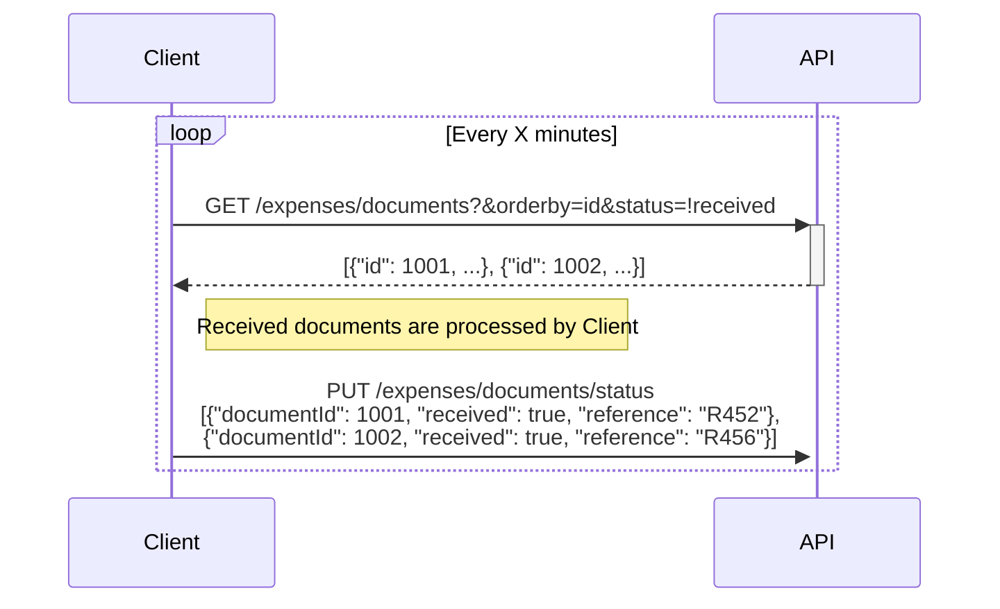

CostPocket Service to Service API
---

<br>

- **DOCS**: https://api.costpocket.com/s2s
- **BASEURL**: https://api.costpocket.com/s2s/v1
- **DOCUMENT VERSION**: 1.0.12
- **API VERSION**: 1.4.3
- **LAST UPDATE**: 2022/11/16

<br>

# Preface

This document describes the Service to Service (S2S) API for integrating accounting systems with CostPocket (CP). Althought the name indicates that it is meant for connections between services it can also be used to integrate individual clients with CP. The API offers various possibilities to export data from CP, such as different export schemes and formats.

<div style="page-break-before: always"></div>

# Authentication

The API offers two authetication methods: credentials-based and signature-based authentication. The API user must decide which one to use based on their security requirements. A single set of credentials can offer access to multiple companies in the CP system (single company by default).

## Authenticating with credentials

There are two parameters that are used as authentication credentials: `API ID` and `API TOKEN`. At the moment those credentials can only be obtained through customer support or through CP Connect services (service activation system).

`API ID` and `API TOKEN` must be specified in the request headers (contains example values):
```
api-id|apiId=3216779a-1fad-0ca1-8913-cfed75b7bdcd
api-token|apiToken=j5HPDgRkhv3oWbGpNOmok4vwgrzULk5GTrf96UKGbUc=
```

## Authenticating with signature

Signature based authentication requires two parameters: `API ID` and `API KEY`. API ID must be specified in the request headers as describe above. API KEY is used to create request signature with the following method:
```
signature = HEX_Encode(HMAC("sha256", api_key, sign_input))
sign_input= req_method_uppercase + req_path + timestamp + req_body
```

If request does not include a body (such as GET method) then `req_body` must be ommited.

Signature and timestamp must be included in the request headers.

Example:
- api-key = e99f94aee1a5dfc861a8fd2816e96088
- req_body = ''
- timestamp = '2021-01-22T11:05:04+02:00'
- req_path = '/test'

Request headers:
```
timestamp=2021-01-22T11:05:04+02:00
api-id|apiId=3216779a-1fad-0ca1-8913-cfed75b7bdcd
signature=c697cac288a0ca9f40a7d3a4882bfccbc8a7d0e580e819bb5cefbd83d9975938
```

<div style="page-break-before: always"></div>

# Examples

Please note that the URL queries in the given examples include non-encoded characters for the sake of the reader.

## Status based document retrieval

In this example we will demonstrate how to obtain ready to be processed documents using the document status. Internally, the documents can have many different statuses (bitwise enum), however this API allows using only one status: `received` or `!received`.

The aim here is to create a loop that obtains documents with status `!received` (not received) and marks them `received` once they have been successfully processed.



### Notes

1) The "referece" in the request `PUT /expenses/documents/status` refers to the id or tag in the Client system that was created when the document was processed. CP may show it in the cloud in order to allow the Client user to match the document in the accounting system and CP system.

2) Keep in mind that the client's company may already exist in the CP system before the API connection is made and that they may have documents in the system that have already been accounted for. In order to not include documents that were created before the API connection was setup, an additional filter can be added to the request `GET /expenses/documents?where=createdAt>2021-01-01&orderby=id&status=!received` (createdAt>2021-01-01 indicates to filter out documents created before 1. Jan 2021).

3) In case of a processing error, the error information can be included as follows:
    ```json
    {
        "documentId": 1002,
        "received": false,
        "error": {
            "reasonPhrase": "Import failed because ..."
        }
    }
    ```
    NB! The `error.reasonPhrase` is not currently saved or shown to the user - this is a planned feature.

## Retrieving documents and reports

CP allows specifying the customer how do they want the documents to be imported in their accounting system:
1) Import all documents and single documents
2) Import only reports
3) Import reports and single documents

This example provides how to use the API in order to (3) import reports and single documents. Please read the example [Status based document retrieval](<#Status based document retrieval>) before continuing.

In order to exclude documents that are part of reports in the `GET /expenses/documents` the following filter must be added: `tripId~null`. The example request to get only single documents becomes `GET /expenses/documents?where=tripId~null&orderby=id&status=!received`.

Reports ready for processing can be retrieved with `GET /expenses/reports?status=!received`.

Once the report has been processed in the client system, the report status can be updated with `PUT /expenses/reports/:reportId/status`:
```json
{
    "received": true,
    "error": {
        "reasonPhrase": "Import failed because ... (this field will become visible for users in the future)"
    }
}
```

It is also possible (but not necessary) to notify CostPocket when document or report is deleted in the accounting system. This will effectively reset the expense to the pre-departure state:
```json
{
    "deleted": true
}
```

Document statuses can be managed via endpoint `PUT /expenses/documents/status`:
```json
[
    {
        "documentId": 1001,
        "received": true,
        "reference": "R452"
    }, {
        "documentId": 1003,
        "received": true,
        "reference": "R456"
    },
    {
        "documentId": 1003,
        "deleted": true
    }
]
```

<div style="page-break-before: always"></div>

# Changelog

### 1.0.11

- It is no longer required to pass filter `digitized=true` for querying documents. It is sufficient to only use status=received and status=!received for status control.

### 1.0.12

- Defined `deleted` option when updating document statuses.